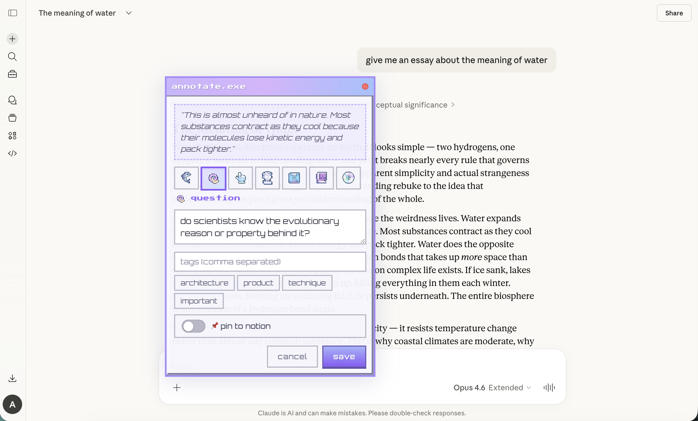
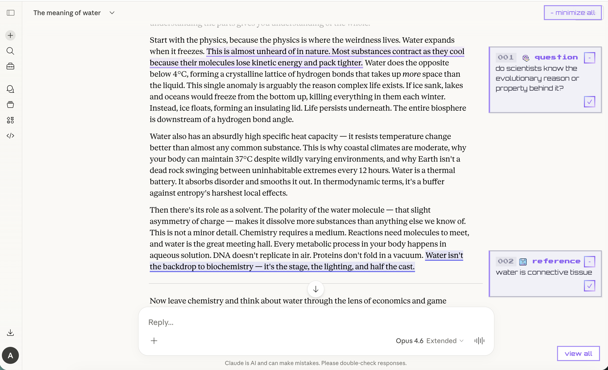
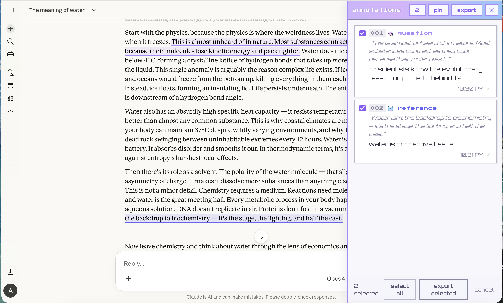

```
                                        (
                                   (   (
        )              )\  )\ (            (
     ( /(  `  )    (  ((_)((_))\   (      ))\
     )(_)) /(/(    )\  _   _ ((_)  )\ )  /((_)
    ((_)_ ((_)_\  ((_)| | | | (_) _(_/( (_))
    / _` || '_ \)/ _ \| | | | | || ' \))/ -_)
    \__,_|| .__/ \___/|_| |_| |_||_||_| \___|
          |_|
```

# claudemot

> annotate your claude chats like a book. highlight text, write margin notes, bookmark your thinking.

every claude conversation gets a structured collection of your reactions, questions, and insights that you can bring back into future conversations or use to index your chats.

[](LICENSE)

```
·  ˚  ✦  .  ·  ˚  ✦  .  ·  ˚  ✦  .  ·  ˚  ✦  .  ·  ˚  ✦  .
```

## developer note

**the why:** wanted to annotate while reading claude, especially when you had multiple things to reply to or note

**the friction:** claude search across chats is ass and wanted to keep a backend record of notables for learning topics or flags for interesting things to note

**the motivation:** our everyday tools should spark delight and have some whimsy

**the name:** «mot» means "word" in french to ref words-driven purpose, but pronounced like infamous "clawdbot"

**the moment:** my first code project and open-source project — expectations low, feedback welcome

☕ [buy me a coffee](https://ko-fi.com/apollineproduction)

---

## what it does

hold **Option** and select any text in a claude conversation → a cute pixel-art popup appears → pick an annotation type, add your note → it stays pinned to that text as a highlighted overlay with a sticky note in the margin.

at the end of a session, export all your annotations as structured markdown you can paste into a new claude chat, or sync them to notion.

<!
screenshots go here — add images to a screenshots/ folder and reference like:



>

---

## features

### highlight + annotate
hold **Option** (Alt on Windows) and select text on any claude.ai chat page. a draggable popup window (annotate.exe) appears where you can pick a type, write a note, and add tags. normal text selection (without Option) works as usual for copy/paste.

### 7 annotation types

| icon | type | use it for... |
|------|------|---------------|
| 🐬 | insight | things that resonated |
| 〰️ | question | things to dig deeper on |
| 👉 | action item | things to address |
| 👤 | idea | thoughts that were sparked |
| 💾 | reference | things to explore later |
| 🖥️ | issue | disagreements or bugs |
| 💿 | pattern | recurring themes you notice |

### margin notes
google docs-style sticky notes appear on the right side of the chat. click a highlight to expand its card. each annotation gets a sequential number (001, 002, 003...) so you can track the order of your thinking.

### sidebar
press `cmd+shift+s` (or click the floating button at the bottom-right) to open the full annotation sidebar. see all your notes for the current chat, multi-select to pin or export, and click any annotation to scroll to its highlight.

### export to clipboard
exports your annotations as structured markdown organized by type — ready to paste into a new claude chat. the format looks like:

```
here are my thoughts from this session:
- insight: "the key architectural decision was..."
- question: "how does this handle edge cases with..."
- action item: "refactor the auth middleware to..."
```

### pin to notion
optionally sync annotations to a notion database. each annotation becomes a page with its type, note, tags, and a link back to the original chat.

### resolve
when you're done with an annotation, resolve it. it disappears from your local view. if it was pinned to notion, it gets marked "resolved" there but stays in your database for reference.

### tags
add freeform tags to any annotation. recent tags are suggested when you create new annotations.

---

## install (chrome)

1. clone this repo:
   ```bash
   git clone https://github.com/apollinej/claudemot.git
   cd claudemot
   ```

2. install dependencies and build:
   ```bash
   npm install
   npm run build
   ```

3. load in chrome:
   - go to `chrome://extensions`
   - enable "developer mode" (top right toggle)
   - click "load unpacked"
   - select the `dist/` folder

4. navigate to any `claude.ai/chat/*` page — the extension activates automatically

---

## settings

### connecting to notion (optional)

notion integration lets you pin annotations to a database for long-term reference. here's how to set it up:

1. **create a notion integration**
   - go to [notion.so/my-integrations](https://www.notion.so/my-integrations)
   - click "new integration"
   - give it a name (e.g. "claudemot")
   - copy the api key (starts with `ntn_`)

2. **create your notion databases**
   - create a new page in notion for your annotations
   - create two databases on that page:
     - **chat sessions** — with properties: `title` (title), `chat url` (url), `project` (select), `created` (date)
     - **annotations** — with properties: `title` (title), `session` (relation to chat sessions), `type` (select), `note` (rich text), `highlight` (rich text), `tags` (multi-select), `status` (select: active/resolved), `pinned` (checkbox)
   - connect your integration to the page: click `...` menu → `connections` → add your integration

3. **configure the extension**
   - click the claudemot icon in your toolbar → "options"
   - paste your notion api key
   - enter the database IDs for both your sessions and annotations databases
   - (you can find database IDs in the URL when you open a database as a full page)

> your api key is stored locally in your browser's extension storage. it never goes anywhere except directly to the notion api.

### auto-pin toggle

in the annotation popup, there's a toggle for "pin to notion". when turned on, every annotation you create automatically syncs to notion. when off (the default), annotations stay local-only until you explicitly pin them from the sidebar.

you can set the default in the options page — useful if you always want to sync, or if you prefer to curate which notes make it to notion.

---

## how to use each feature

### creating an annotation
1. hold **Option** (Alt on Windows) and select any text in a claude conversation
2. the annotate.exe popup appears near your selection
3. pick an annotation type (click one of the 7 pixel icons)
4. write your note in the text area
5. optionally add tags (comma-separated)
6. toggle "pin to notion" if you want it synced
7. click "save" (or press `cmd+enter`)

### using the sidebar
- press `cmd+shift+s` or click the floating button in the bottom-right corner
- see all annotations for the current chat in sequential order
- click any annotation card to scroll to its highlight in the chat
- use multi-select mode to pin or export multiple annotations at once

### pinning to notion
- **single annotation**: toggle "pin to notion" ON when creating it
- **multiple annotations**: open the sidebar → check the annotations you want → click "pin"
- **auto-pin**: enable in options to pin everything by default

### exporting to clipboard
- open the sidebar → click "export" in the header (exports all)
- or: check specific annotations → click "export" in the action bar
- paste the markdown into a new claude chat to continue the conversation with context

### resolving annotations
- in the margin rail: click the checkmark button on a card → confirm "yes"
- resolved annotations are removed from your local view
- if pinned to notion, they're marked "resolved" but preserved

---

## development

```bash
# install dependencies
npm install

# build for production
npm run build

# the build outputs to dist/ — reload the extension in chrome after building
```

the build uses three separate vite configs:
- `vite.config.ts` — popup + options pages (es modules)
- `vite.config.content.ts` — content script (iife bundle)
- `vite.config.sw.ts` — service worker (iife bundle)

### project structure
```
src/
  content/
    content-script.ts      — main entry, mouseup listener, save/resolve/pin
    annotation-popup.ts     — draggable creation window (annotate.exe)
    highlight-renderer.ts   — wraps text in <mark>, renders margin rail cards
    sidebar.ts              — cmd+shift+s panel with annotation list
    session-tracker.ts      — extracts chat id from url, spa navigation
  background/
    service-worker.ts       — chrome storage crud, notion sync, message routing
  lib/
    types.ts, constants.ts, storage.ts, export.ts, notion-client.ts, icons.ts
  styles/
    content.css             — all extension styles (pixel font, chrome palette)
  popup/                    — extension toolbar popup
  options/                  — settings page
```

---

## contributing

contributions welcome! this is a small passion project, so:

1. fork it
2. create your branch (`git checkout -b feat/cool-thing`)
3. make your changes
4. build and test locally (`npm run build`, reload extension in chrome)
5. open a pr

---

## aesthetic

claudemot uses a y2k desktop-core aesthetic:
- **fonts**: press start 2p (pixel) for headers, orbitron for body text
- **palette**: silver / chrome / iridescent purple
- **style**: pixel-art icons, retro window chrome, glass morphism
- everything lowercase, always

---

## license

[MIT](LICENSE)

<div align="center">

```
˚ . ✦ · 💿 · ✦ . ˚
```

made with 💿 by [apolline](https://ko-fi.com/apollineproduction)

*every routine tool needs a little whimsy*

</div>
